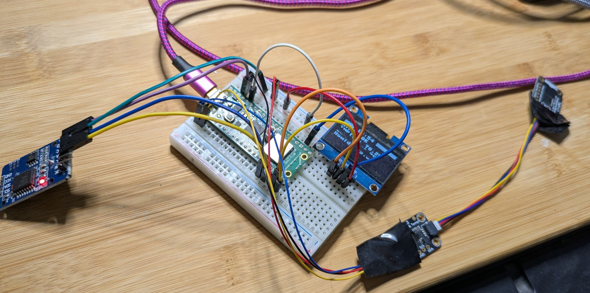
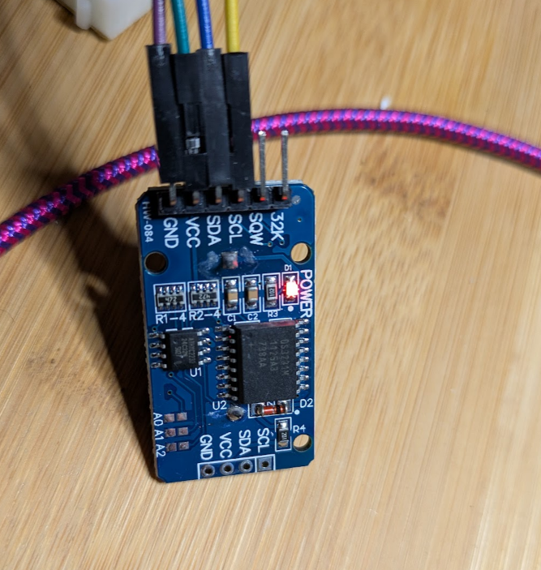

# Using a DS3231 RTC with Raspberry Pi Pico: A Troubleshooting Journey

## Introduction

The Raspberry Pi Pico doesn't have a built-in Real-Time Clock (RTC) with battery backup, which means it loses track of time whenever it's powered off. Enter the DS3231 RTC module - a popular solution that keeps time running even when your project is unplugged. This guide walks through setting up a DS3231 (including the quirky clone modules) with the Pico using MicroPython.

## BTW
I added this to my oled and Adafruit sensor setup:

It was a rainy day and I finally got a round to doing this.


## Hardware Requirements

- Raspberry Pi Pico
- DS3231 RTC Module (genuine or clone)
  Voila:

- 4 jumper wires
- CR2032 battery (optional - only needed for timekeeping when powered off)

## Wiring

Connect the DS3231 to your Pico:

```
DS3231    →    Pi Pico
------------------------
VCC       →    3.3V (pin 36)
GND       →    GND (pin 38)
SDA       →    GP12 (or any I2C SDA pin)
SCL       →    GP13 (or any I2C SCL pin)
```

**Important:** Use 3.3V, not 5V! The Pico's GPIO pins are not 5V tolerant.

## The Journey: From Error to Success

### Step 1: The First Attempt (Failed)

We started with what seemed like straightforward code:

```python
from machine import I2C, Pin
import time

i2c = I2C(0, scl=Pin(13), sda=Pin(12), freq=400000)
DS3231_ADDR = 0x68

# This gave us: OSError: [Errno 5] EIO
```

The dreaded `EIO` error! This means I2C communication failed.

### Step 2: Verify the Connection

Before going further, we checked if the device was even visible:

```python
from machine import I2C, Pin

i2c = I2C(0, scl=Pin(13), sda=Pin(12), freq=400000)
devices = i2c.scan()
print("Devices found:", [hex(d) for d in devices])
```

Output:
```
Devices found: ['0x57', '0x5f', '0x68']
```

Success! The device at `0x68` is our DS3231. The other addresses (`0x57` and `0x5F`) are the AT24C32 EEPROM chips included on many DS3231 modules for data logging.

**Note:** In this setup, we had other I2C devices (TMP117 and SHTC3 temperature sensors, plus an OLED) on different GPIO pins (GP0/GP1), so they didn't appear in this scan. The Pico allows multiple pin pairs for the same I2C peripheral.

### Step 3: Still Can't Read or Write

Even though `i2c.scan()` found the device, trying to read from it failed:

```python
data = i2c.readfrom_mem(DS3231_ADDR, 0x00, 7)
# Still getting: [Errno 5] EIO
```

This is a common issue with clone DS3231 modules!

### Step 4: The Solution

Two key changes made it work:

1. **Slow down the I2C speed** (from 400kHz to 100kHz)
2. **Add a delay after initialization**

```python
from machine import I2C, Pin
import time

i2c = I2C(0, scl=Pin(13), sda=Pin(12), freq=100000)  # Slower speed
time.sleep(0.1)  # Critical for clone modules!
```

After these changes:
```python
data = i2c.readfrom_mem(DS3231_ADDR, 0x00, 7)
print("Read successful:", [hex(b) for b in data])
# Output: Read successful: ['0x44', '0x0', '0x0', '0x1', '0x1', '0x1', '0x0']
```

Cool...It works

## Complete Working Code

Here's the final, tested code that works with clone DS3231 modules:

```python
from machine import I2C, Pin
import time

# Initialize I2C with slower speed and delay
i2c = I2C(0, scl=Pin(13), sda=Pin(12), freq=100000)
time.sleep(0.1)  # Critical for clone modules!

DS3231_ADDR = 0x68

def bcd_to_decimal(bcd):
    """Convert Binary-Coded Decimal to normal decimal"""
    return (bcd >> 4) * 10 + (bcd & 0x0F)

def decimal_to_bcd(decimal):
    """Convert normal decimal to Binary-Coded Decimal"""
    return ((decimal // 10) << 4) | (decimal % 10)

def set_time(year, month, day, hour, minute, second):
    """Set the RTC time - only need to do this once"""
    data = bytearray(7)
    data[0] = decimal_to_bcd(second)
    data[1] = decimal_to_bcd(minute)
    data[2] = decimal_to_bcd(hour)
    data[3] = decimal_to_bcd(1)  # day of week (1-7)
    data[4] = decimal_to_bcd(day)
    data[5] = decimal_to_bcd(month)
    data[6] = decimal_to_bcd(year - 2000)
    i2c.writeto_mem(DS3231_ADDR, 0x00, data)
    print("Time set successfully!")

def read_time():
    """Read time from the RTC"""
    data = i2c.readfrom_mem(DS3231_ADDR, 0x00, 7)
    second = bcd_to_decimal(data[0] & 0x7F)  # Mask oscillator bit
    minute = bcd_to_decimal(data[1])
    hour = bcd_to_decimal(data[2] & 0x3F)    # Mask 12/24 hour bits
    day = bcd_to_decimal(data[4])
    month = bcd_to_decimal(data[5] & 0x1F)   # Mask century bit
    year = bcd_to_decimal(data[6]) + 2000
    return (year, month, day, hour, minute, second)

# Set the current time (only need to run once)
set_time(2025, 11, 15, 18, 45, 0)

# Main loop - display time every second
while True:
    year, month, day, hour, minute, second = read_time()
    print(f"{year}-{month:02d}-{day:02d} {hour:02d}:{minute:02d}:{second:02d}")
    time.sleep(1)
```

## Understanding BCD (Binary-Coded Decimal)

You might be wondering: "What's this BCD thing?"

The DS3231 stores time values in BCD format, where each decimal digit is represented by 4 bits:
- Normal binary for 25: `00011001`
- BCD for 25: `00100101` (2 in upper 4 bits, 5 in lower 4 bits)

Our conversion functions translate between BCD (what the RTC uses) and normal decimal numbers (what Python uses).

## Usage Tips

### Do I Need the Battery?

**No!** The CR2032 battery is only needed if you want the RTC to keep time when the Pico is powered off. For testing or projects that stay powered, you can skip the battery entirely.

### Setting Time After Reboot

If you're running without a battery, you'll need to set the time each time you restart:

```python
# Run this after each reboot
set_time(2025, 11, 15, 18, 45, 0)  # Adjust to current time
```

### Clone vs Genuine Modules

Clone DS3231 modules work fine but may require:
- Slower I2C speeds (100kHz instead of 400kHz)
- The initialization delay (`time.sleep(0.1)`)
- Less accurate timekeeping (genuine modules are ±2ppm or ~1 minute/year) (Says Claude.ai!)

## Troubleshooting

### `OSError: [Errno 5] EIO`

This I2C error means communication failed. Try:
1. Check your wiring (especially VCC to 3.3V, not 5V)
2. Verify correct pin numbers in your code
3. Add `time.sleep(0.1)` after I2C initialization
4. Reduce frequency to 100kHz or even 10kHz
5. Remove the battery if installed backwards
6. Try different jumper wires (loose connections are common)

### Device Not Found in Scan

If `i2c.scan()` returns an empty list:
1. Double-check all wire connections
2. Verify you're using the correct GPIO pins
3. Try the other I2C bus: `I2C(1, ...)` instead of `I2C(0, ...)`

### Time Resets After Power Cycle

This is normal without a battery!
- Install a CR2032 battery
- Store the last known time and restore it on startup (but just for fun...obviously)

## Multiple I2C Devices

The Pico has two I2C buses, so you can connect multiple devices:
- **I2C0**: GP0/GP1, GP4/GP5, GP8/GP9, GP12/GP13, GP16/GP17, GP20/GP21
- **I2C1**: GP2/GP3, GP6/GP7, GP10/GP11, GP14/GP15, GP18/GP19, GP26/GP27

In our case, the RTC was on GP12/GP13 (I2C0), while an OLED and thermometers were on a different bus - no conflicts!

## Advanced: Reading Temperature

The DS3231 has a built-in temperature sensor (used for temperature compensation). You can read it:

```python
def read_temperature():
    """Read temperature from DS3231 (in Celsius)"""
    data = i2c.readfrom_mem(DS3231_ADDR, 0x11, 2)
    temp = data[0] + (data[1] >> 6) * 0.25
    return temp

temp = read_temperature()
print(f"Temperature: {temp}°C")
```

Note: Clone modules may have less accurate temperature readings.
## Safety
#
#  Backup Power Safety: CR2032 Hazard Mitigation

The DS3231 RTC module includes an on-board charging circuit that presents a safety hazard if used with standard, non-rechargeable **CR2032** coin cells.

## The Hazard 🚨

Most DS3231 modules are designed to provide a trickle charge to a **rechargeable LIR2032** cell whenever the main 5V power is connected.

If a primary (non-rechargeable) **CR2032** is installed, the continuous charging current can cause the cell to **swell, leak, overheat, or rupture**, posing a fire and chemical risk.

see https://lastminuteengineers.com/ds3231-rtc-arduino-tutorial/


## Safety Testing and Verification

To ensure the safety of the circuit, a test was performed to verify the exact charging voltage the module outputs onto the battery terminals when powered by 5V.

### **The Multimeter Test Procedure**

1.  **Remove** the battery from the holder.
2.  **Power up** the module (connect VCC to 5V and GND to GND).
3.  Set your multimeter to **DC Voltage**.
4.  Place the Red probe on the **positive clip** of the empty battery holder.
5.  Place the Black probe on the **GND** pin of the module.

| Test Condition | Expected "Danger" Result | **Actual Result** | Interpretation |
| :--- | :--- | :--- | :--- |
| Voltage measured on empty battery terminals | $\sim5.0V$ (Raw VCC) | **$\sim3.0V$** | **SAFE.** The module uses an internal regulator to limit the voltage, protecting the cell from raw VCC. |

## Solution: Using the LIR2032 Rechargeable Cell 🔋

The 3.0V measured output confirmed that the module is designed for charge maintenance.

To eliminate the hazard without modifying the hardware, the correct solution is to use the rechargeable counterpart: the **LIR2032 Lithium-Ion cell.**

* **Safety:** The LIR2032 is chemically designed to accept the continuous charging current provided by the module.
* **Module Compatibility:** The V_BAT pin of the DS3231 chip safely tolerates the LIR2032's maximum voltage of **4.2V**.
 The module's $3.0V$ output ensures the LIR2032 is maintained at a safe, stable charge level.

So using an **LIR2032** battery ensures the integrity of the RTC backup system and prevents the hazards associated with charging a primary CR2032 cell.


## Conclusion

Getting a clone DS3231 working with the Pico required some patience and troubleshooting, but the solution was simple: slow down the I2C bus and add a small initialization delay. These modules are perfect for projects that need timekeeping, and at a fraction of the cost of genuine modules.

NOTE: I used Claude AI - I had never used these modules and I did not really get the best hits from google/youtube for some reason. 

The key takeaways:
- Use 100kHz I2C frequency for reliability
- Add `time.sleep(0.1)` after I2C initialization
- I removed my suspect cr2302 just since I didn't need it right now.
- Battery is optional if your project stays powered
- Clone modules can work great once configured properly

